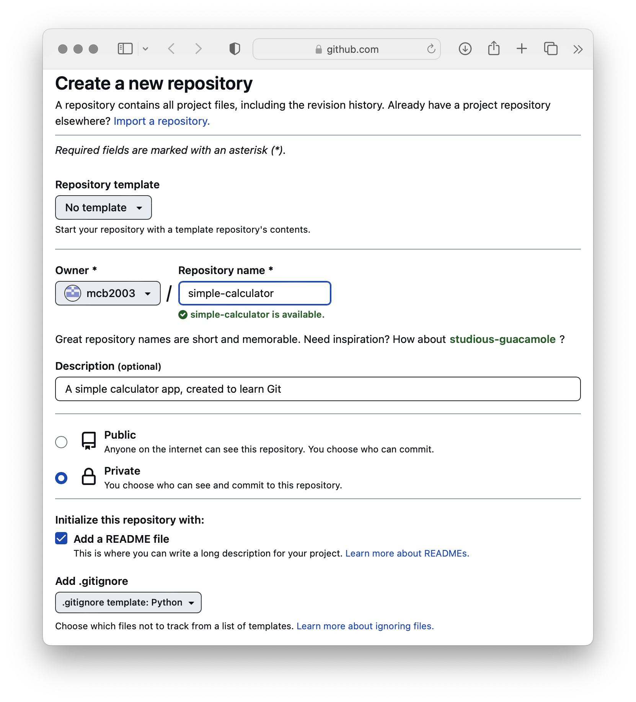
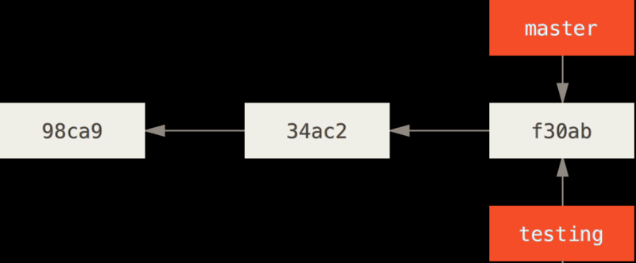

# Connect with Us!

Join us on social media to stay in the loop, and learn about upcoming sessions and events.

[](https://stirlingcomputer.club/qr/)

----------------------------------------

# Effective Git

*Michael Connor Buchan* <mikey@blindcomputing.org>

> Basic git usage involves typing a few stock commands to “sync everyone up”. Many people who are frustrated with git
> become so because they never progress beyond this surface-level understanding of how it works. However, mastering git
> is easily worth your time.

-- [Tips for a Disciplined Git Workflow - Drew DeVault][git-discipline]

Licensed under [CC By SA 4.0][cc]

[cc]: https://creativecommons.org/licenses/by-sa/4.0/deed.en

----------------------------------------

# What is Git?

* Git is a version-control system
* Git is distributed
* Git is everywhere!


----------------------------------------

## Git is a Version Control System

A Version Control System (VCS) is a very useful tool. It allows you to:

* Revert selected files back to a previous state
* Revert the entire project back to a previous state
* Compare changes over time
* See who last modified something that might be causing a problem (who introduced an issue and when)
* Easily collaborate on projects with others

With a VCS, If you screw things up or lose files, you can easily recover, and you can merge the work of several people together automatically.

----------------------------------------

## Git is Distributed

* Git lets you pull changes from, and push changes to, remote copies of your project repository
* Each copy stores the entire project history (every version of every file)
* Hosted code-forges like [Github][gh], [Gitlab][gl], and [Sourcehut][srht] provide a central place from which to distribute your repository, and accept contributions from others

[gh]: https://github.com
[gl]: https://gitlab.com
[srht]: https://sr.ht

----------------------------------------

## Git is Everywhere!

Git scales, from the smallest of hobby projects, to the Linux kernel, one of the largest free software projects in the
world, and the project git was created for Millions of developers, acting individually or working for thousands of
companies, use git every day

It has become the de facto standard version control system for much of the industry

Google, Microsoft, Twitter, LinkedIn, Netflix, Perl, PostgreSQL, Android, Linux, Ruby, on, Rails, QT, Gnome, Eclipse, KDE, X

----------------------------------------

# Installing Git

[](./install/)

stirlingcomputer.club/sessions/git/install

Scan to learn how to set up git

----------------------------------------

## Create a Test Repo

1. Sign in or create an account on [github.com][gh]
2. Go to [repo.new](https://repo.new)
3. Add a name, description, and tick the box to add a README
4. Keep your repository private for now
5. Select a gitignore for your language if one exists
    * this prevents git from saving various temporary files and build artefacts generated by your language of choice
6. choose a license for your code
    * It pays to have a high-level understanding of each common FOSS license, and the difference between permissive and
      copyleft licenses. Check out [choosealicense.com][choose-a-license] and
      [writefreesoftware.org][write-free-software].

[choose-a-license]: https://choosealicense.com/
[write-free-software]: https://writefreesoftware.org

----------------------------------------

## Create a Test Repo



----------------------------------------

## Clone the Repo Locally

* Open a Git Bash (Windows), or a Terminal (macOS & Linux)
* Change directory to the location you’d like your repository to be stored
* Issue the `git clone` command, passing the URL of the Github repository

**Tip**: You can create a repo locally, without using Github, by running `git init name`, where name is the name of the directory you want to create
    
---------------------------------------- 

## Structure of the Repo

    * Once the repo has been cloned, change directory into its working directory
* You’ll see a `.git` directory in the working directory (this is the database git keeps of every version of every tracked file, plus metadata)
* Depending on what options you chose when creating the repo, you may also see `README.md`, `LICENSE` and / or `.gitignore` (Github has created an initial commit for you with these files)

----------------------------------------

## Create a Greeting File

1. In your repo, create a new file, `greeting.txt`, and save it with the text "Hello, wrold"
    * **Note**: That typo is deliberate, we'll fix it later

----------------------------------------

## the Git Workflow

Git stores your project’s history as a series of commits. Each commit represents a snapshot of what every file in your repository looks like in that particular revision.

Git has three main states that your files can reside in: modified, staged, and committed:

* **Modified** means that you have changed the file but have not committed it to your database yet.
* **Staged** means that you have marked a modified file in its current version to go into your next commit snapshot.
* **Committed** means that the data is safely stored in your local database.

When working with Git, you check out the project from the repository into your working directory. You then make changes
to files, stage those changes in the staging area, and finally commit those changes back to the repository.

----------------------------------------

## The Staging Area

Newcomers to git often overlook the staging area, and prefer to use `git commit -a` to automatically stage all files
that have changed, and commit at the same time. I recommend against this.

From [Tips for a Disciplined Git Workflow][git-discipline]:

> Every commit should only contain one change - avoid sneaking in little unrelated changes into the same commit.
> Additionally, avoid breaking one change into several commits, unless you can refactor the idea into discrete steps -
> each of which represents a complete change in its own right. ... Additionally, every commit should compile and run all
> tests successfully, and should avoid having any known bugs which will be fixed up in a future commit.

----------------------------------------

## Commit your Changes

We’re ready to write our first commit! Unsurprisingly, this is done with the `git commit` command

* Type `git commit` to open an editor where you can write a commit message
* You can also run `git commit -m`, passing a message in quotes
* Commit messages are free-form plain text, used to explain what the changes in this commit achieve.

----------------------------------------

### Good Commit Messages

These are **as important as good code comments**, especially in collaborative projects!

* The first line is a short summary, which should be less than 50 characters (like an email subject)
* The summary should complete this sentence: when applied, this commit will…
    * “Fix text rendering in CJK languages”
    * “Add support for protocol v3”
    * “Refactor CRTC handling”
* After a blank line, you may describe what the changes achieve in greater detail (like an email body)

**See also**: [Tips for a Disciplined Git Workflow][git-discipline] from which I stole those examples

[git-discipline]: https://drewdevault.com/2019/02/25/Using-git-with-discipline.html

----------------------------------------

### Good Commit Messages

Based on the above advice, and since this is a very simple change, an appropriate commit message for this commit might
be:

> **Add greeting file**
> 
> This is used to practice advanced git features.

Save and close your editor, and git will make the commit.

----------------------------------------

## Viewing the History

* Use the `git log` command to view a project’s history
* “Git log” will open a pager program if the log is long enough that it will scroll, Exit this by pressing “q”

Each commit is composed of:

* A SHA1 commit hash, which uniquely identifies this commit
* The author’s name and email address
* The date the commit was made
* The commit message
* The updated files (though these aren’t shown in the log by default)

----------------------------------------

## Viewing the History

**Tip**: “git log” has many options for customising what you see:

* `Git log --oneline` (One commit per line)
* `Git log --stat` (Show which files were changed)
* `Git log --summary` (show only the summary line of each message)
* `Git log -5` (show the latest 5 commits)

You need not remember all of these (`git log --help` will display all available options), but they're often useful.
    
----------------------------------------

## Undoing and Restoring Things: Untracked Changes

The power of a VCS is that you can go backwards in time to undo something you did wrong, or restore something you accidentally removed

* Let's accidentally delete our `greeting.txt` file
* Whoops, we’d like to revert the changes we made to this file, let’s check `git status`
* Git notices the file has been removed, and suggests two possible options: add the modifications to git’s database, or restore the file to your working directory
* Running the `git restore file` command, where file is the path to the file you deleted, brings the old version back from git’s database
    
----------------------------------------

## Undoing and Restoring Things: Staged Changes

If you’ve already staged your changes, and would like to un-stage them, run `git reset HEAD file`, where file is the path to the file to un-stage

This command is a little strange, and `HEAD` must be written in upper case. `git reset` is a very versatile command that
can do a lot more than simply un-staging changes you’ve made to a file or set of files. For more info, see [Reset
Demystified][reset-demystified]

[reset-demystified]: https://git-scm.com/book/en/v2/Git-Tools-Reset-Demystified

----------------------------------------

# Editing History

> Who controls the past controls the future. Who controls the present controls the past.

-- “1984” by George Orwell

Looks like we made a typo in our greeting (oh no!).

In many other version control systems, a repo's history is read-only, so to fix this, we'd have to make another commit.

Git takes a different approach, and allows you to edit the history as much as you want. Proponents of this approach
argue that editing history is much like refactoring code, and makes the project easier to maintain.

----------------------------------------

## Amending our Commit

The easiest way to fix our typo while keeping our history clean is by amending our existing commit.

* Fix the `greeting.txt` file so it says "Hello, world!"
* Stage your changes with `git add greeting.txt`
* Now, amend your previous commit by running `git commit --amend`
    * Your editor will open and allow you to change the commit message, you can save and close it as we want to keep the
      existing message

----------------------------------------

## Editing Older Commits

`git commit --amend` can only be used to edit the last commit. What about the rest of the history?

* Edit `greeting.txt` once again, so that it simply says "Hello"
* Commit your changes:
    ```sh
    git add greeting.txt
    git commit -m"Add greeting.txt"
    ```
* Now, create a new file called `goodbye.txt`, with the contents "Goodbye, world!", add, and commit it.

----------------------------------------

Your git log should now look something like this:

```
commit c6ebd6c85c622950806bed28850d6a1c02f17626
Author: Michael Connor Buchan <mikey@blindcomputing.org>
Date:   Wed Sep 25 14:17:26 2024 +0100

    Add goodbye.txt

commit deebfb0a62a84527b3f3829b2a66fac9a780359d
Author: Michael Connor Buchan <mikey@blindcomputing.org>
Date:   Wed Sep 25 14:16:58 2024 +0100

    Add greeting.txt
```

----------------------------------------

## Making a Fixup Commit

Looks like we forgot to add ", world!" to `greeting.txt`. Ideally, we'd fix this in the commit that added
`greeting.txt`, but it isn't the most recent commit, so we can't use `git commit --amend`.

To fix this, we first have to make a fixup commit. Modify `greeting.txt` once again to say "Hello, world!", and make a
"fixup" commit.

```sh
git add greeting.txt
git commit -m "fixup"
```

----------------------------------------

## Interactive Rebase - The Ultimate History Editing Tool

To clean up our history, we'll use the interactive mode of `git rebase`, a very powerful tool! It allows us to:

* Reorder commits
* Edit commit messages
* Edit files in commits
* Squash multiple commits into a single commit
* Split a single commit into multiple commits

----------------------------------------

## Running an Interactive Rebase

To start an interactive rebase, run

```sh
git rebase -i HEAD~3
```

* `-i` starts an *interactive* rebase
* `HEAD~3` specifies what range of commits to rebase
    * `HEAD` always points to the tip of your current branch
    * `~3` subtracts 3 commits from `HEAD`, meaning we're rebasing the 3 most recent commits

----------------------------------------

## Running an Interactive Rebase

Your editor will open, with a **rebase todo plan** that you can edit:

```
pick deebfb0 Add greeting.txt
pick c6ebd6c Add goodbye.txt
pick e9ab997 fixup

# Rebase 04de917..e9ab997 onto 04de917 (3 commands)
#
# Commands:
# p, pick <commit> = use commit
# r, reword <commit> = use commit, but edit the commit message
# e, edit <commit> = use commit, but stop for amending
# s, squash <commit> = use commit, but meld into previous commit
# f, fixup [-C | -c] <commit> = like "squash" but keep only the previous
#                    commit's log message, unless -C is used, in which case
#                    keep only this commit's message; -c is same as -C but
#                    opens the editor
# ...
```

----------------------------------------

## Running an Interactive Rebase

An interactive rebase first rewinds your branch to the point before any of these commits were applied, then "picks" each
of the commits, and re-applies them based on the todo plan you write. The default plan just picks each commit
one-by-one, in their original order, which would achive nothing, so let's modify it.

* Reorder the lines in the file, placing the "fixup" commit after the commit that modifies `greeting.txt`.
* On the line for the "fixup" commit, change the `pick` command to `fixup`, or just `f`.

```
pick deebfb0 Add greeting.txt
fixup e9ab997 fixup
pick c6ebd6c Add goodbye.txt
```

----------------------------------------

## Running an Interactive Rebase

Save and exit your editor, and git will perform the rebase operation. If everything goes well, you shoud see:

```
Successfully rebased and updated refs/heads/main.
```

The fixup commit has been squashed into your "Add greeting.txt" commit, so the history now looks like this:

```
commit 6fbd92b58078ce5f0fe3f050b62b29bf85467751
Author: Michael Connor Buchan <mikey@blindcomputing.org>
Date:   Wed Sep 25 14:17:26 2024 +0100

    Add goodbye.txt

commit 83bf5e05849ae204404f8eaafe5087b0a133ba2c
Author: Michael Connor Buchan <mikey@blindcomputing.org>
Date:   Wed Sep 25 14:16:58 2024 +0100

    Add greeting.txt
```

----------------------------------------

## Squashing Multiple Commits into One

When working on something complex, you may find it useful to commit something bit by bit. With `git rebase` in your
toolbox, you can make as many commits as you want, then **squash** them down into a single commit afterwards.

* We'll start by making several commits
    ```sh
    echo "This " >> squash.txt && git add squash.txt && git commit -m "Add 'this' to squash.txt"
    echo "is " >> squash.txt && git add squash.txt && git commit -m "Add 'is' to squash.txt"
    echo "a " >> squash.txt && git add squash.txt && git commit -m "Add 'a' to squash.txt"
    echo "test " >> squash.txt && git add squash.txt && git commit -m "Add 'test' to squash.txt"
    ```

----------------------------------------

## Squashing Multiple Commits into One

To clean up this history, let's begin an interactive rebase:

```sh
git rebase -i HEAD~4
```

```
pick 00d72f5 Add 'this' to squash.txt
pick d698e7a Add 'is' to squash.txt
pick 281a29c Add 'a' to squash.txt
pick 95630cd Add 'test' to squash.txt
```

----------------------------------------

## Squashing Multiple Commits into One

Edit the last 3 lines to tell git to squash the commits into the previous one:

```
pick 00d72f5 Add 'this' to squash.txt
squash d698e7a Add 'is' to squash.txt
squash 281a29c Add 'a' to squash.txt
squash 95630cd Add 'test' to squash.txt
```

Save and exit, and your editor will re-open so you can edit the commit message.

----------------------------------------

### Edit the Commit Message

```
# This is a combination of 4 commits.
# This is the 1st commit message:

Add 'this' to squash.txt

# This is the commit message #2:

Add 'is' to squash.txt

# This is the commit message #3:

Add 'a' to squash.txt

# This is the commit message #4:

Add 'test' to squash.txt
```

----------------------------------------

## Squashing Multiple Commits into One

Save and quit once again, and git will complete the interactive rebase:

```
[detached HEAD e06b35b] Add 'this is a test' to squash.txt
 Date: Wed Sep 25 15:38:33 2024 +0100
 1 file changed, 4 insertions(+)
 create mode 100644 squash.txt
Successfully rebased and updated refs/heads/main.
```

----------------------------------------

## Splitting Large Commits

What if you want to do the opposite: split one large commit into a few smaller commits?

For this we'll write some actual code, so save the following as `hello.py`:

```python
from datetime import datetime

print("Hello, world, it's " + str(datetime.today()))
```

And commit it:

```sh
git add hello.py
git commit -m "Add Python program skeleton"
```

----------------------------------------

## Splitting Large Commits

Now, update the program as so:

```python
from datetime import datetime

def get_name():
    name = input("What is your name? ")
    return name.strip() # Trim whitespace

name = get_name()
now = datetime.today()
print(f"Hello, {name}, it's {now}")
```

Remember to stage and commit these changes

----------------------------------------

## Splitting Large Commits

To split up this commit, begin another interactive rebase:

```sh
git rebase -i HEAD~2
```

```
pick 34e58c9 Add Python program skeleton
pick dcf3cb2 Flesh out Python program
```

----------------------------------------

## Splitting Large Commits

Change the second command from `pick` to `edit`, save and exit, and git will stop so you can edit the commit:

```
pick 34e58c9 Add Python program skeleton
edit dcf3cb2 Flesh out Python program
```

```
Stopped at dcf3cb2...  Flesh out Python program
You can amend the commit now, with

  git commit --amend '-S'

Once you are satisfied with your changes, run

  git rebase --continue
```

----------------------------------------

## Splitting Large Commits

What we need to do now is unstage the last commit by performing a soft reset, so we can make changes and re-stage them.

```sh
git reset HEAD^
```

```
Unstaged changes after reset:
M	hello.py
```

----------------------------------------

## Splitting Large Commits

`git status` now shows:

```
interactive rebase in progress; onto e06b35b
Last commands done (2 commands done):
   pick 34e58c9 Add Python program skeleton
   edit dcf3cb2 Flesh out Python program
No commands remaining.
You are currently splitting a commit while rebasing branch 'main' on 'e06b35b'.
  (Once your working directory is clean, run "git rebase --continue")

Changes not staged for commit:
  (use "git add <file>..." to update what will be committed)
  (use "git restore <file>..." to discard changes in working directory)
	modified:   hello.py

no changes added to commit (use "git add" and/or "git commit -a")
```

----------------------------------------

## Splitting Large Commits

We now need to add only part of `hello.py` to our next commit. Git provides us with interactive commits for this
purpose:

```sh
git commit --patch
# or: git commit -p
```

**Tip**: `git commit -p` interactively asks you about all files that have changed that git is tracking. To stage only
part of a specific file, you can use `git add -p` instead, it works the same way.

----------------------------------------

## Splitting Large Commits
The output of `git commit -p` is as follows:

```
diff --git a/hello.py b/hello.py
index 34fe9f9..5b286ca 100644
--- a/hello.py
+++ b/hello.py
@@ -1,3 +1,11 @@
 from datetime import datetime
 
-print("Hello, world, it's " + str(datetime.today()))
+
+def get_name():
+    name = input("What is your name? ")
+    return name.strip()  # Trim whitespace
+
+
+name = get_name()
+now = datetime.today()
+print(f"Hello, {name}, it's {now}")
(1/1) Stage this hunk [y,n,q,a,d,e,?]? ^[ 
```

In this format:

* The first 4 lines are just a header
* The next line specifies how many lines were added and removed, and is another header
* Lines starting with ' ' (a space) are context lines, to give you an idea of what part of the file you're looking out
* Lines starting with '+' were added to the file
* Lines starting with '-' were removed from the file

----------------------------------------

## Splitting Large Commits

Git is asking us if we want to commit all these changes. Since we'd like to split this up further, we can try the `s`
(split) command:

```
(1/1) Stage this hunk [y,n,q,a,d,e,?]? s
Sorry, cannot split this hunk
```

In this case, git doesn't know how to split this hunk by itself, but depending on exactly *how* the file was changed, it
may be able to do so.

----------------------------------------

## Splitting Large Commits

Instead we'll edit it manually, by pressing `e`. This will open your editor and show the hunk, along with the following
instructions:

```
# To remove '-' lines, make them ' ' lines (context).
# To remove '+' lines, delete them.
# Lines starting with # will be removed.
# If the patch applies cleanly, the edited hunk will immediately be marked for staging.
# If it does not apply cleanly, you will be given an opportunity to
# edit again.  If all lines of the hunk are removed, then the edit is
# aborted and the hunk is left unchanged.
```

Edit the file so only the `get_name()` function was added, save and exit.

----------------------------------------

## Splitting Large Commits

Now that we've staged a smaller amount of changes, the interactive commit continues, and we can enter a commit message:

> Implement get_name() function in hello.py

Once this is done, let's commit the rest of the changes, which should be a familiar process to you:

```sh
git add hello.py
git commit -m "Use get_name() in hello.py to greet user personally"
```

----------------------------------------

## Splitting Large Commits

One last thing. Running `git status` shows we're still rebasing:

```
interactive rebase in progress; onto e06b35b
Last commands done (2 commands done):
   pick 34e58c9 Add Python program skeleton
   edit dcf3cb2 Flesh out Python program
No commands remaining.
You are currently editing a commit while rebasing branch 'main' on 'e06b35b'.
  (use "git commit --amend" to amend the current commit)
  (use "git rebase --continue" once you are satisfied with your changes)

nothing to commit, working tree clean
```

Let's finish up this interactive rebase:

```sh
git rebase --continue
```

```
Successfully rebased and updated refs/heads/main.
```

----------------------------------------

Your history will now look like this:

```
commit a4b3b41cc968f5d9e5d89b0fe3e35342a9fc01e4
Author: Michael Connor Buchan <mikey@blindcomputing.org>
Date:   Wed Sep 25 16:20:53 2024 +0100

    Use get_name() in hello.py to greet user personally

commit bfcc5df9e7e0cfeed3cd57fa63a662483a6ed519
Author: Michael Connor Buchan <mikey@blindcomputing.org>
Date:   Wed Sep 25 16:20:34 2024 +0100

    Implement get_name() function in hello.py

commit 34e58c9757fd1567c2b84a4a3a0ca3d5ec25e549
Author: Michael Connor Buchan <mikey@blindcomputing.org>
Date:   Wed Sep 25 15:57:47 2024 +0100

    Add Python program skeleton
```

----------------------------------------

# Branches: Multiple Parallel Histories

* Git supports lightning fast, light weight branches, which are a great way to work on multiple features of a project at once, while keeping the changes you make for one feature separate from the changes of another
* Branches allow you to diverge from the main history of the project, work on something for a while, then merge that work back into the main branch, or any other branch for that matter
* Branches are light weight and fast because they don’t make a new copy of all your data, they simply point to your existing commits
* Git keeps a special pointer called “HEAD” that points to the branch you’re currently on
* When you create a new repository, you start out on the “main” branch This branch isn’t special in any way, it’s just a regular branch that happens to be the default
* Depending on how you create your repository, your default branch might be “master”, or even something else, but it is nevertheless just a completely normal branch
    
----------------------------------------

# Branches: Multiple Parallel Histories



----------------------------------------

## Branching Workflows

There are a number of different ways to use git branches, the two most common are:

* Long running branches
* Topic branches

----------------------------------------

### Long Running Branches

Imagine a big, production-quality open-source project hosted on a code-forge like [Github][gh]. Pull requests will be
opened, reviewed, and merged, and ultimately their commits will end up on the `main` branch. Then, periodically,
when things have been tested and are confirmed to be stable, a release will be made from the `main` branch.

But what if the project also wants to offer a "long-term support(LTS)" release? LTS releases of projects remain frozen
in terms of features, but commonly have security fixes backported to them.

----------------------------------------

### Long Running Branches

To do this, an `lts` branch can be created, which always represents the state of the latest LTS release. The fast-paced,
less well tested work can continue on `main`, and tools like [`git cherry-pick`][git-cherry-pick] can be used to choose
specific fixes from the `main` branch, and apply them to the `lts` branch.

[git-cherry-pick]: https://algocademy.com/blog/mastering-git-cherry-pick-a-comprehensive-guide-to-selective-commit-management/

We don't have time to cover `git cherry-pick` here, but it's fairly straight-forward to use, click the above link for
more information.

----------------------------------------

### Topic Branches

When you're working on multiple features at once, you'll want to separate your strings of commits out into separate
branches, one per topic. This makes it easier to compartmentalise work, and to merge one feature into the `main` branch
at a time.

Topic branches are often local to your copy of a repo, and need not be pushed to Github or whatever your common upstream
is, but larger features that multiple people work on may necessitate pushing a topic branch to the remote. Be sure to
clean them up when you've finished working on them!

----------------------------------------

#### Tips for Topic Branches

* **Give them a descriptive name**: branch names are as important as variable names, they're read more often than
  they're written
* **Keep your topic branches up to date with the base branch**: Use `git rebase main` (or whatever the base branch is)
  on topic branches frequently, to merge in new commits from the base branch, and test that they work with your changes.
  Be sure to do this right before your feature is merged to `main` as well.
* **Use a branch higherarchy if appropriate**: Topic branches need not be based off of `main`, they can be branched from
  other topic branches. Be sure to name your branches consistently (I.E. `audio/streaming` for a streaming branch based
  off an `audio` branch)

----------------------------------------

# There is so much more!

We have nowhere near enough time to cover everything today, but here are a few more things to explore:

----------------------------------------

## It's all Your Fault! Blaming People with `git blame`

Ever worked on a collaborative project, found some code you don't understand or that is broken, and wished you could
know who wrote it so you can ask them? Git has just the tool for you, [`git blame`][git-blame]! It shows you who last
changed each individual line of code in the project, along with their email address.

Learn more with this ["Ultimate guide"][git-blame-guide].

[git-blame]: https://git-scm.com/docs/git-blame
[git-blame-guide]: https://www.kosli.com/blog/the-ultimate-guide-to-git-blame-a-how-to-with-examples/

----------------------------------------

## Tracking Down Bugs with `git bisect`

What if instead of finding *who* is responsible for some code, you want to find out *which commit* introduced an issue?
You could manually test each commit via a process of elimination, but why do that, when git can do it for you?

[`git bisect`][git-bisect] performs a [binary search][binary-search] of your commits, tracking down exactly which one
introduced a bug you're trying to fix. All you have to do is write a script to test your software for the specific bug,
and `git bisect` will find out when the regression was committed!

Learn how to use `git bisect` using this [getting started guide][git-bisect-guide].

[git-bisect]: https://git-scm.com/docs/git-bisect
[binary-search]: https://en.wikipedia.org/wiki/Binary_search
[git-bisect-guide]: https://www.metaltoad.com/blog/beginners-guide-git-bisect-process-elimination

----------------------------------------

## Collaborating over Email with `git send-email`

Code-forges definitely make getting started with collaborative development easier, but for projects as large as the
Linux kernel or the GNU project, relying on a single code-forge doesn't make sense, plus these projects predate Github
and many of the other forges.

Git was designed from the ground-up to facilitate collaboration over good-old, old-school email, and many projects still
accept patches via a mailing list. Some forges like [Sourcehut][srht] support this workflow natively as well,  and git
itself provides tools like [`git send-email`](https://git-scm.com/docs/git-send-email) and [`git am`][git-am] to make
working with patches from email easier.

Check out Sourcehut's [`git send-email` tutorial](https://git-send-email.io) to learn how to use git with email.

[git-am]: https://git-scm.com/docs/git-am

----------------------------------------

# Useful Resources

This presentation was inspired by, and borrows lots of material from, the following resources:

* [The official git book](https://git-scm.com/book/en/v2)
* [Convensional Commits](https://www.conventionalcommits.org/en/v1.0.0/) (a standardised format for commit messages used
  by many large projects)
* [git-rebase.io](https://git-rebase.io/)
* [git-send-email.io](https://git-send-email.io/) (learn to contribute to email-based projects like the Linux kernel)
* [Tips for a Disciplined Git Workflow][git-discipline] (if you read one article on git, make it this one)
* [How to manage your Git history: Tips for keeping your commits tidy](https://ubuntu.com/blog/tricks-for-keeping-a-tidy-git-commit-history)
* [Git Branching Workflows](https://git-scm.com/book/en/v2/Git-Branching-Branching-Workflows) (long running and topic
  branches)
* [My unorthodox, branchless git workflow](https://drewdevault.com/2020/04/06/My-weird-branchless-git-workflow.html) (learn about an alternative to topic branches)
* You can always contact me <mikey@blindcomputing.org> if you have any further git questions, I'll try to help
  where I can

----------------------------------------

# Connect with Us!

Join us on social media to stay in the loop, and learn about upcoming sessions and events.

[](https://stirlingcomputer.club/qr/)
